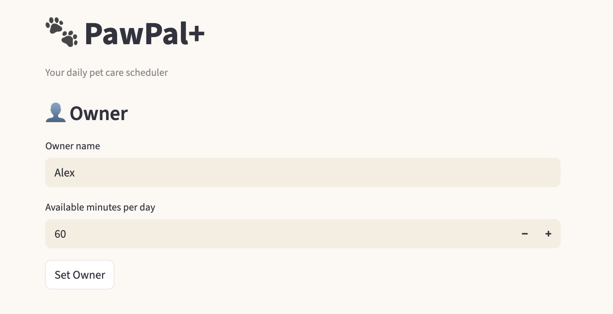
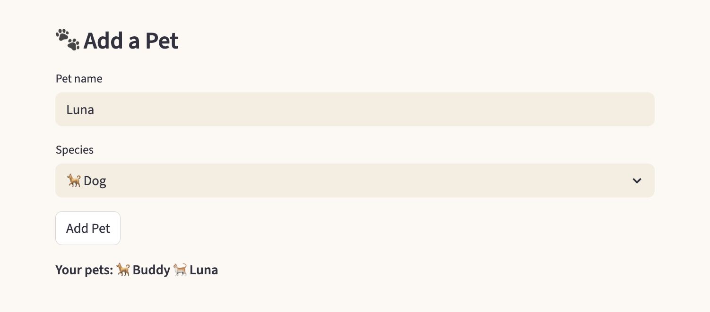
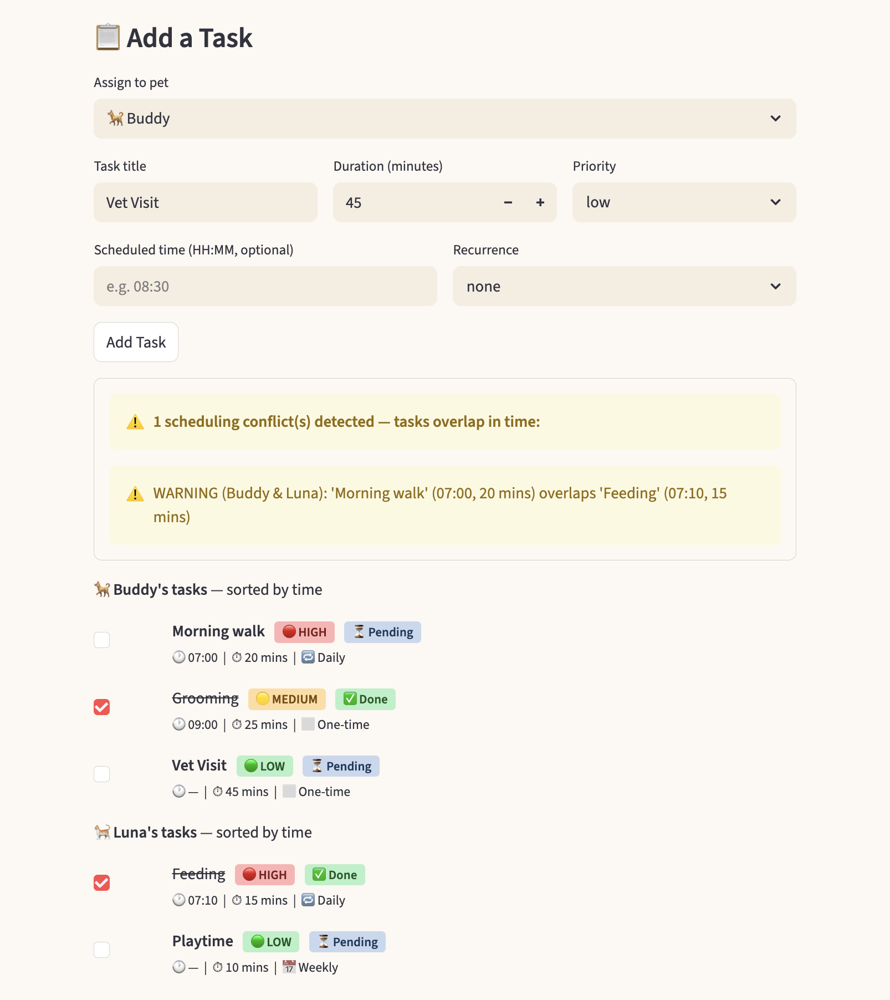
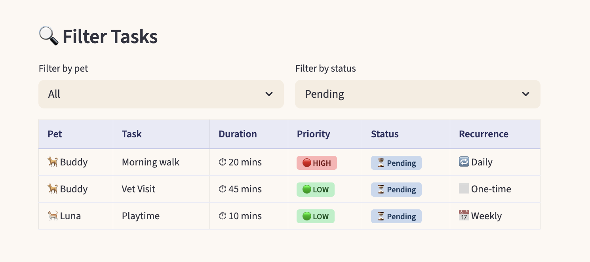
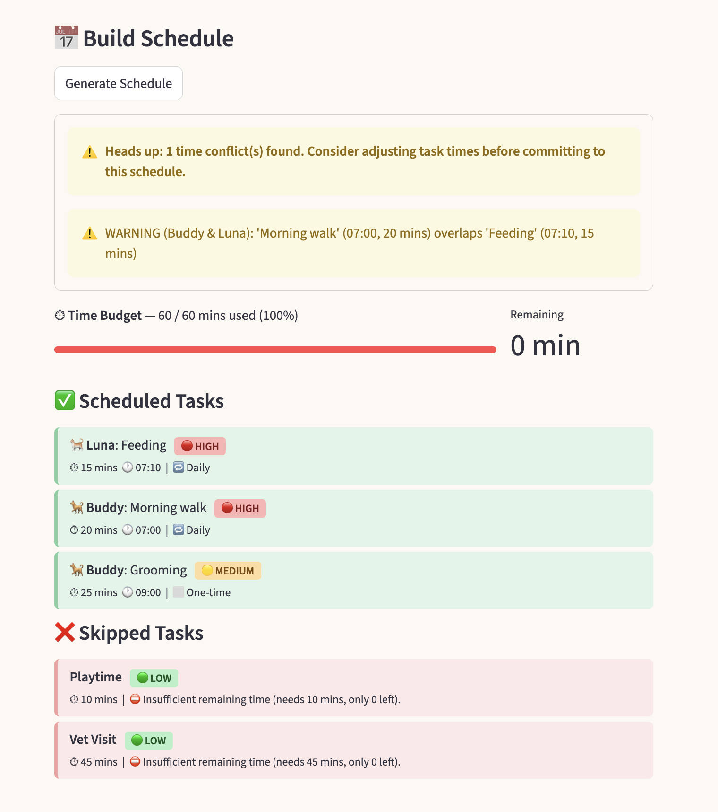

# PawPal+

**PawPal+** is a Streamlit app that helps pet owners plan and track daily care tasks across multiple pets. It generates a priority-based daily schedule, detects scheduling conflicts, and automatically re-queues recurring tasks after completion.

## Features

- **Priority-first scheduling** — `generate_plan()` uses a greedy algorithm that orders tasks by priority (HIGH → MEDIUM → LOW), using duration as a tie-breaker (shortest first). Tasks that exceed the remaining time budget are skipped with an explanation.
- **Daily and weekly recurrence** — Tasks can be marked `daily` or `weekly`. When a task is completed, `apply_recurrence()` automatically spawns the next instance with an advanced due date, preventing double-spawning on repeat calls.
- **Conflict detection** — `detect_conflicts()` compares all timed tasks and surfaces a warning whenever two tasks overlap on the schedule. Warnings are shown inline in the task list and again before the generated plan. Back-to-back tasks (end == start) are not flagged.
- **Chronological sorting** — `sort_by_time()` returns tasks sorted by `scheduled_time` (HH:MM); tasks with no scheduled time appear last.
- **Flexible filtering** — `Owner.get_filtered_tasks()` filters tasks by completion status, pet name (case-insensitive), or both at once.
- **Time budget progress** — The generated schedule displays a progress bar showing minutes used vs. the owner's daily budget, with each scheduled or skipped task explained.
- **Multi-pet support** — An owner can have multiple pets; tasks are assigned per pet and displayed and scheduled together.

## 📸 Demo

| Description | Screenshot |
|-------------|------------|
| **Owner setup** — Enter an owner name and daily time budget (in minutes), then click "Set Owner" to initialize the session. |  |
| **Add a Pet** — Add one or more pets by name and species. Added pets are listed immediately below the form. |  |
| **Task list** — Tasks are displayed per pet in a table sorted by scheduled time, showing duration, priority, recurrence, and completion status. Conflict warnings appear inline when tasks overlap. |  |
| **Filter Tasks** — Filter the task list by pet, completion status (Pending / Completed), or both at once. |  |
| **Generated schedule** — The scheduler produces a priority-ordered daily plan with a time-budget progress bar, listing scheduled tasks in green and skipped tasks (with reasons) in red. |  |

## Running the app

```bash
python -m venv .venv
source .venv/bin/activate  # Windows: .venv\Scripts\activate
pip install -r requirements.txt
streamlit run app.py
```

## Running the tests

```bash
python -m pytest tests/test_pawpal.py -v
```

### Test coverage

The suite contains **24 tests** across five behavioral areas:

| Area | What is verified |
|------|-----------------|
| **Sorting** | Tasks return in chronological order; untimed tasks (`scheduled_time=None`) always sort last; no crash when all tasks are untimed |
| **Recurrence** | A completed daily task spawns a new instance due the next day; weekly tasks advance by 7 days; non-recurring tasks never spawn; calling `apply_recurrence()` twice does not create duplicate next-occurrences |
| **Conflict detection** | Overlapping timed tasks produce a warning string; back-to-back tasks (end == start) do not; cross-pet overlaps are caught; no timed tasks returns an empty list |
| **Plan generation** | High-priority tasks are scheduled first; same-priority tasks pick shortest-first; tasks due tomorrow are excluded; overdue tasks are included; a zero-minute budget skips everything; a task that exactly fills the budget is accepted |
| **Filtering** | `get_filtered_tasks` filters by completion status, pet name (case-insensitive), and nonexistent pets return `[]`; `Plan.summary()` contains the owner name, time budget, and both section headers |
