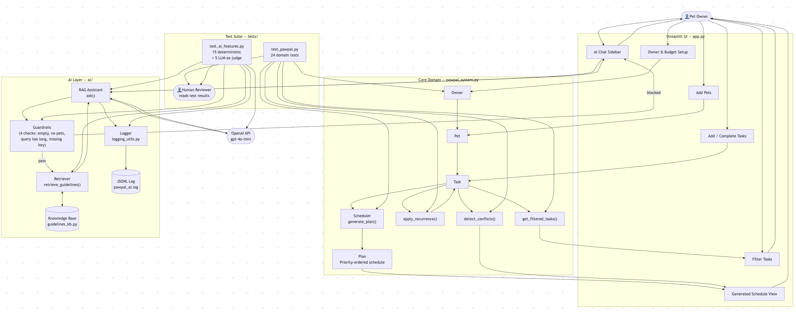

# PawPal+

**PawPal+** is an AI-powered pet care assistant that helps multi-pet owners plan daily care schedules, detect conflicts, and get grounded answers to species-specific care questions — all in a single Streamlit app.

---

## Original Project

This project extends **PawPal Pet Management System** (Modules 1–3), a Python-based CLI tool for managing tasks across multiple pets with a shared daily time budget. The original app let owners add pets and care tasks, generate a priority-ordered schedule, detect time conflicts, and mark recurring tasks as complete. It had no AI features — scheduling logic was purely algorithmic, and care advice required the owner to look things up elsewhere.

PawPal+ adds a RAG-powered chat assistant that answers pet care questions using a curated species-specific knowledge base, with guardrails and structured logging built in.

---

## Advanced AI Features

This project implements two of the required advanced AI features:

| Feature | Implementation |
|---------|---------------|
| **Retrieval-Augmented Generation (RAG)** | Before every OpenAI call, `rag_assistant.py` queries a local species-specific knowledge base (`guidelines_kb.py`) and injects the retrieved guidelines directly into the prompt. The model is explicitly instructed to answer only from that context — retrieved data actively shapes every response, not just accompanies it. |
| **Reliability & Testing System** | 20 tests in `tests/test_ai_features.py` measure AI performance at two tiers: 15 deterministic tests verify guardrail behavior, retrieval correctness, and JSONL log format without any API calls; 5 LLM-as-judge tests make live OpenAI calls to score response groundedness and relevance. All AI events are also logged to `ai/pawpal_ai.log` with timestamps and token counts for ongoing monitoring. |

---

## Why It Matters

Pet owners juggling multiple animals often struggle to balance care tasks across a limited daily time budget, and generic AI chatbots give inconsistent advice when asked about pet care specifics. PawPal+ solves both problems in one place: a scheduler grounded in real constraints, plus a care assistant grounded in documented guidelines — not model hallucinations.

---

## Architecture Overview



The system has two layers:

**Core scheduling layer** — Five Python classes handle all domain logic: `Owner` holds the shared time budget and list of pets; `Pet` owns a task list; `Task` stores title, duration, priority, recurrence, and due date; `Scheduler` runs a greedy priority-first algorithm over all of an owner's pets; and `Plan` holds the structured output with per-task reasons.

**AI layer** — The `ai/` package contains three modules. `guidelines_kb.py` is a static knowledge base of species-specific care facts (dogs, cats, rabbits, birds, fish, and an "other" fallback). `rag_assistant.py` retrieves relevant guidelines by keyword matching before every OpenAI call, injects them into a constrained system prompt, fires four input guardrails, and logs every event. `logging_utils.py` writes structured JSONL to `ai/pawpal_ai.log` with timestamps, token counts, and content previews.

The Streamlit UI in `app.py` wires both layers together: scheduling features are always available, while the AI chat sidebar appears only after an owner and at least one pet are configured and an API key is present.

---

## Setup Instructions

```bash
# 1. Clone the repo and enter the directory
git clone https://github.com/tmahi/applied-ai-system-project.git
cd applied-ai-system-project

# 2. Create and activate a virtual environment
python -m venv .venv
source .venv/bin/activate       # Windows: .venv\Scripts\activate

# 3. Install dependencies
pip install -r requirements.txt

# 4. Set your OpenAI API key (required for the AI chat sidebar)
export OPENAI_API_KEY=your-key-here   # Windows: set OPENAI_API_KEY=your-key-here

# 5. Run the app
streamlit run app.py
```

The scheduling features work without an API key. The AI chat sidebar is hidden automatically when no key is set.

---

## Sample Interactions

### 1 — Generating a daily schedule

**Setup:** Owner "Alex" with a 60-minute budget; one dog (Buddy) with three tasks — Morning walk (30 min, HIGH), Medication (5 min, HIGH), Extended playtime (40 min, LOW).

**Generated plan output:**
```
Scheduled:
  ✓ Morning walk — 30 min (HIGH)   [reason: high priority]
  ✓ Medication   —  5 min (HIGH)   [reason: high priority]

Skipped:
  ✗ Extended playtime — 40 min (LOW)  [reason: only 25 min remaining]

Time used: 35 / 60 min  ████████░░░░░░░░  58%
```

### 2 — Conflict detection warning

**Setup:** Same owner; two tasks with overlapping scheduled times — Morning walk at 08:00 (30 min, ends 08:30) and Vet checkup at 08:15 (20 min).

**Inline warning shown in task list:**
```
⚠ Conflict: "Morning walk" (08:00–08:30) overlaps with "Vet checkup" (08:15–08:35)
```

### 3 — RAG care assistant

**User question:** "How often should I walk my dog and for how long?"

**AI response (grounded in retrieved guideline `dog/walk`):**
```
Based on the care guidelines for Buddy (dog):

Dogs need at least 20–30 minutes of walking per day. Larger or more active breeds
benefit from 45–60 minutes. Daily walks support both physical and mental health —
skipping more than one day in a row is not recommended. Given Buddy's current
30-minute morning walk task, this aligns with the minimum daily recommendation.
```

---

## Design Decisions

| Decision | What I chose | Trade-off |
|----------|-------------|-----------|
| **Scheduling algorithm** | Greedy priority-first (HIGH → MEDIUM → LOW, shortest-first tie-break) | Simpler and fast enough for short daily task lists; a knapsack optimizer would pack budgets tighter but adds complexity that isn't justified for 5–40 min tasks |
| **`Scheduler` input** | Takes `Owner` only, iterates `owner.pets` internally | Early design passed `Owner` + `Pet` separately — this silently doubled the time budget for multi-pet owners; one owner → one shared pool fixes that |
| **AI approach** | RAG with a local knowledge base over fine-tuning | Fine-tuning is expensive to update; adding a new species is one dict key in `guidelines_kb.py` with RAG |
| **System prompt** | Explicitly constrained to retrieved context only | Trades recall (won't use broad model knowledge) for reliability — responses stay consistent and auditable |
| **`Priority` type** | `Priority` enum instead of raw strings | Raw strings allow silent invalid values like `"urgent"`; the enum makes a bad priority a hard error at construction time |

---

## Testing Summary

The test suite has **44 tests** across two files. Run with:

```bash
python -m pytest tests/ -v
```

### What's covered

| Area | # Tests | What is verified |
|------|---------|-----------------|
| **Sorting** | 3 | Chronological order; untimed tasks always last; no crash when all tasks are untimed |
| **Recurrence** | 4 | Daily tasks advance +1 day; weekly +7 days; non-recurring never spawns; no double-spawn on repeat calls |
| **Conflict detection** | 4 | Overlapping tasks produce a warning; back-to-back (end == start) do not; cross-pet overlaps are caught |
| **Plan generation** | 7 | Priority order respected; shortest-first tie-break; zero-budget skips all; exact-fit task is accepted; overdue tasks included, future tasks excluded |
| **Filtering** | 6 | By completion status; by pet name (case-insensitive); nonexistent pet returns `[]`; combined filters |
| **KB retrieval** | 6 | Correct guideline returned for each species (dog, cat, rabbit, bird, fish, other) |
| **Guardrails** | 4 | Empty query, no pets configured, query too long (truncated), missing API key |
| **Logging** | 5 | JSONL format correctness, required fields present, token counts logged |
| **LLM-as-judge** | 5 | Live OpenAI calls verify response groundedness and relevance *(skipped without `OPENAI_API_KEY`)* |

### What worked, what didn't, what's next

| | Notes |
|--|-------|
| **Worked well** | Deterministic tests caught two real bugs: a double-spawn edge case in recurrence, and back-to-back tasks incorrectly flagged as conflicts. LLM-as-judge tests confirmed the constrained prompt actually kept responses on-topic. |
| **Didn't work** | LLM-as-judge tests are non-deterministic and occasionally flake on borderline responses — not reliable enough for CI without a tighter scoring rubric. |
| **Would add next** | Property-based tests for the scheduler (randomized task sets and budgets) and snapshot tests for the RAG prompt structure to catch regressions when the knowledge base changes. |

---

## Reflection

### Constraints matter more than the model
- The RAG assistant works not because GPT-4o-mini is inherently accurate about pet care, but because the prompt tells it to refuse anything outside the retrieved context.
- Removing that constraint in testing produced responses that sounded confident but cited frequencies and durations inconsistent with the knowledge base.
- A system is only as reliable as the guardrails you build around it.

### Know where AI belongs — and where it doesn't
- The scheduler — the core value of the app — required no AI at all.
- A greedy algorithm with clear priority rules is deterministic, testable, and explainable in a way a language model isn't.
- AI earned its place in the layer where the problem is genuinely unstructured: "what's the right way to care for this specific animal?" has too many variables for hand-coded rules, and that's where RAG shines.

### AI is most useful as a design collaborator, not just a code generator
- The most valuable AI contributions during this project weren't code — they were constraint discovery.
- When I described the multi-pet scheduling problem, the model immediately surfaced the shared-budget issue that would have broken the design.
- I still had to evaluate whether the concern was real and decide how to fix it — but having a fast, skeptical second opinion during design accelerated the thinking significantly.
